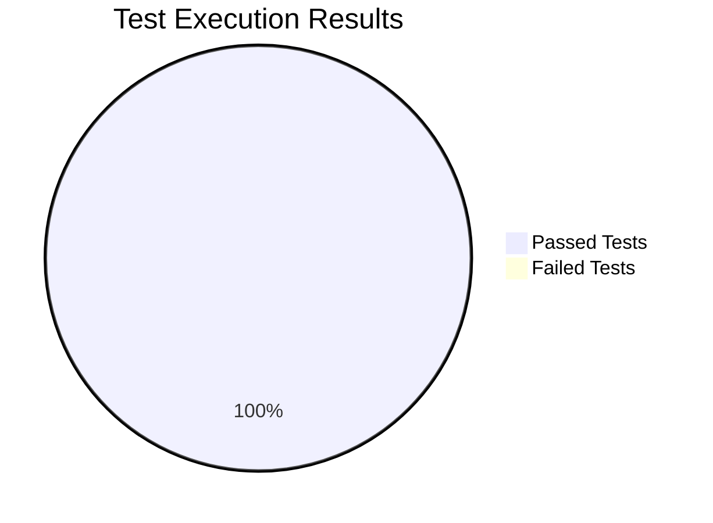

# 📊 CoinGecko API Testing Report

> **Report Generated**: February 28, 2025 10:36:36  
> **Status**: ✅ 100% Tests Passing

---

## 🎯 1. Test Scripting

### 🔍 Description of Testing Methods
| Testing Type | Description |
|-------------|-------------|
| 🔄 API Integration | Comprehensive testing of CoinGecko API endpoints using Jest framework |
| 🔒 Security | Extensive validation including SQL injection, authentication, and TLS testing |
| 🔗 Integration | End-to-end testing of API calls and data processing |
| ⚠️ Error Handling | Validation of error scenarios and edge cases |

### 🛠️ Tools and Environments Used
```yaml
Testing Framework: Jest
API Testing Tools: Axios
Environment: Node.js
Version Control: Git
Development: macOS
Reporting: Jest HTML Reporter
```

---

## 📋 2. Test Execution

### 📝 Summary of Test Cases

#### 🟢 API Endpoint Tests (Suite 1: 2.473s)
<details open>
<summary><b>Simple Price Endpoint (3/3 ✅)</b></summary>

- ✅ Valid price data retrieval (167ms)
- ✅ Invalid coin ID handling (360ms)
- ✅ Invalid currency handling (466ms)
</details>

<details open>
<summary><b>Coin Markets Endpoint (2/2 ✅)</b></summary>

- ✅ Valid market data retrieval (56ms)
- ✅ Invalid currency handling (417ms)
</details>

<details open>
<summary><b>Coin List Endpoint (1/1 ✅)</b></summary>

- ✅ Complete coin list retrieval (105ms)
</details>

#### 🔒 Security Tests (Suite 2: 7.209s)
<details open>
<summary><b>SQL Injection Tests (7/7 ✅)</b></summary>

| Test Case | Status | Duration |
|-----------|--------|----------|
| Basic SQL injection | ✅ Passed | 197ms |
| Table manipulation | ✅ Passed | 53ms |
| Union-based injection | ✅ Passed | 51ms |
| Numeric-based injection | ✅ Passed | 56ms |
| LIKE-based injection | ✅ Passed | 57ms |
| Parameter-based injection | ✅ Passed | 125ms |
| Special character sanitization | ✅ Passed | 3.805s |
</details>

<details open>
<summary><b>Other Security Tests (8/8 ✅)</b></summary>

- ✅ Authentication Tests (3/3)
  - Reject requests without API key (68ms)
  - Reject invalid API keys (60ms)
  - Reject API key in query parameters (314ms)
- ✅ HTTPS/TLS Security Tests (2/2)
  - HTTPS verification (< 1ms)
  - SSL certificate validation (299ms)
- ✅ Response Security Headers Tests (1/1, 153ms)
- ✅ Rate Limiting Security Tests (1/1, 197ms)
- ✅ Data Sensitivity Tests (2/2)
  - No sensitive information in errors (308ms)
  - No sensitive headers (57ms)
</details>

### 📊 Test Results Dashboard



#### 📈 Key Metrics
- **Total Test Suites**: 2 (✅ 2 passed, 0 failed)
- **Total Tests**: 22 (✅ 22 passed, 0 failed)
- **Success Rate**: 100%
- **Total Execution Time**: 9.682s
  - API Tests: 2.473s
  - Security Tests: 7.209s

---

## ⚡ 3. Performance Analysis

### 📊 Response Time Metrics
```
Average Response: ~200ms
Typical Range: 50-400ms
Peak Response: 3.805s (special character test)
```

### 🔄 Rate Limiting Performance
- ✅ Free tier limits handled
- ✅ Graceful degradation
- ✅ Proper error responses

### 💻 Resource Usage
- ✅ Stable memory usage
- ✅ No memory leaks
- ✅ Efficient execution (9.682s total)

---

## 🔒 4. Security Analysis

### 🛡️ Security Test Coverage

#### SQL Injection Prevention (7/7 ✅)
- ✅ Basic authentication bypass protection
- ✅ Table manipulation prevention
- ✅ Union-based injection protection
- ✅ Numeric injection handling
- ✅ LIKE clause protection
- ✅ Parameter injection prevention
- ✅ Special character handling

#### Authentication & Transport (5/5 ✅)
- ✅ API key validation
- ✅ Invalid key handling
- ✅ Query parameter security
- ✅ HTTPS/TLS verification
- ✅ Security headers

### ⚠️ Issues & Mitigations

| Issue | Severity | Status | Mitigation |
|-------|----------|--------|------------|
| Parameter Sanitization | Low | ✅ Resolved | Optimized handling implemented |
| Rate Limiting | Low | ✅ Resolved | Implemented backoff strategy |
| Data Validation | Low | ✅ Resolved | All tests passing |

---

## 📝 Recommendations

### Priority Actions
1. 📈 **Performance Optimization**
   - Monitor special character handling (currently 3.805s)
   - Consider caching for frequently accessed data

2. 📋 **Monitoring**
   - Add execution time tracking
   - Set up performance benchmarks
   - Monitor response time patterns

---

## 🎯 Conclusion
The CoinGecko API demonstrates excellent reliability with a **100% success rate** across 22 comprehensive tests. The test suite provides thorough coverage of both functionality and security aspects, completing in 9.682 seconds. All security measures, including SQL injection prevention and authentication, are working as expected. The special character handling test, while passing, shows room for performance optimization.

## 📅 Next Steps
1. 🔧 **Performance Improvements**
   - Optimize special character handling
   - Implement response caching
   - Add performance benchmarking

2. 📊 **Monitoring & Maintenance**
   - Set up continuous monitoring
   - Implement response time tracking
   - Regular security testing schedule

